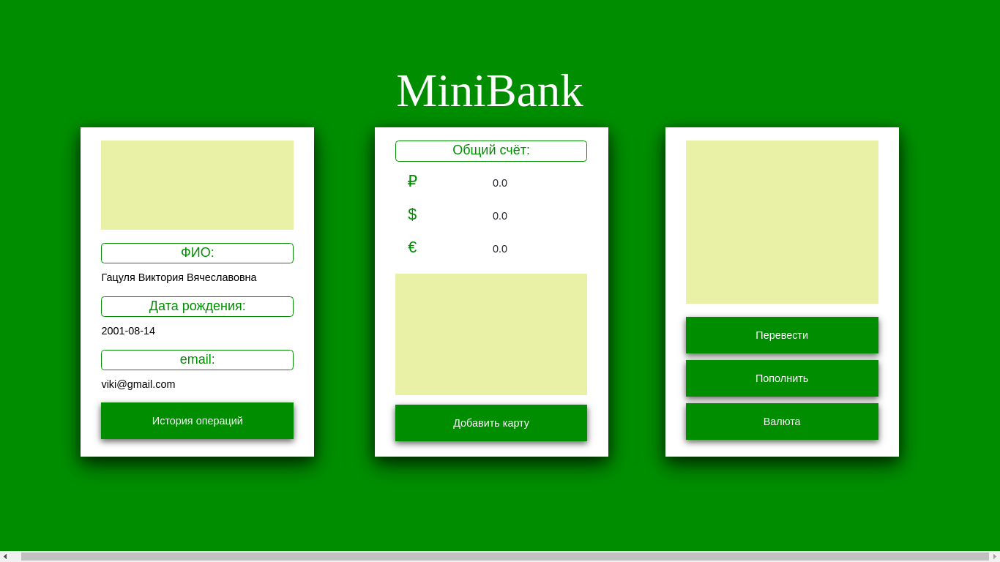
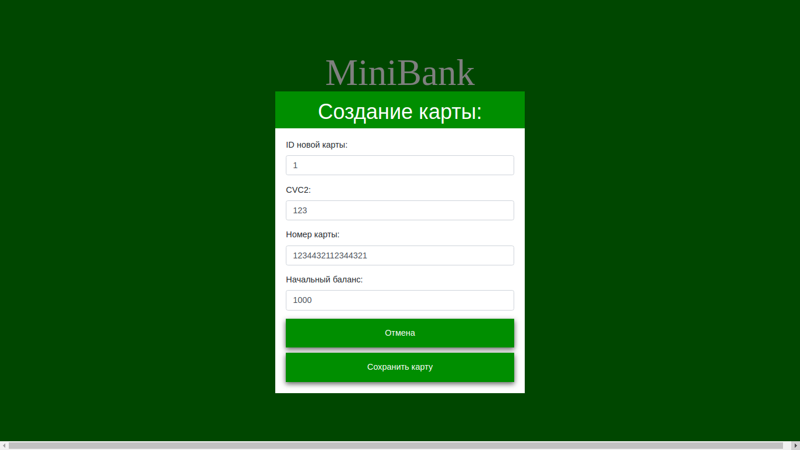
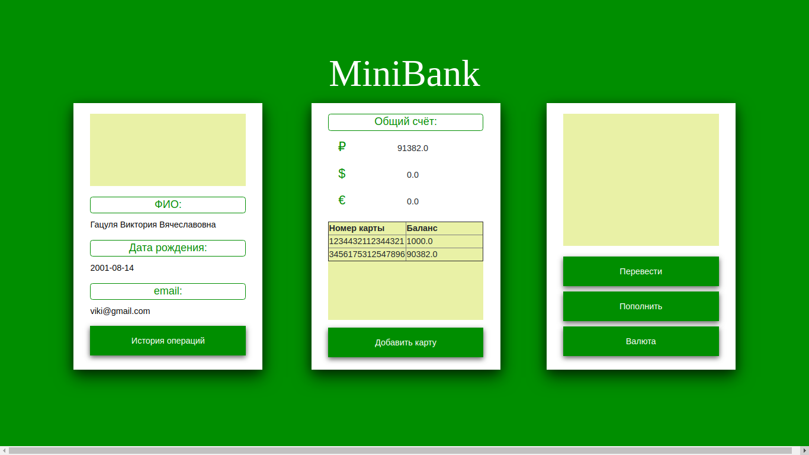

# Mini Bank (DEMO)

**MiniBank - это небольшой сервис, имитирующий поведение банковской системы.**        
* **Добавлнение пользователей**
Добавлять пользователей на нынешней стадии разработки можно только через POST запрос, например:                 
    
     $ curl -H 'Content-Type:application/json' -d '{"user_id" : 1, "userName" : "Гацуля Виктория Вячеславовна", "bankCard" : null, "email" : "viki@gmail.com", "birthday" : "2001-08-14"}' '127.0.0.1:8080/saveBankUser'

В приложении не настроен Spring Security, поэтому зайти в приложение можно под любым пользователем (если пользователь ещё не создан, то отобразится страница "Not found!").      
* **Просмотр страницы пользователя**                
Пример http запроса на просмотр страницы пользователя под номером "1":

    http://127.0.0.1:8080/home/getUserById/id=1    
    
В рабочем состоянии только кнопка "Добавить карту", остальные в стадии разработки.

* **Добавление новой карты для пользователя**             

При нажатии на кнопку "Добавить карту", открывается форма для создания новой банковской карты (банковскую карту пользователь может только для самого себя).
В полях формы настроена только защита от ввода букв, *количество цифр в номере карты и прочее пока не проверяется*.

* **После добавления карт**                     

Номера всех карт и их баланс отображаются в таблице в среднем контейнере. Также отображается общий баланас в поле "Общий счёт"

## Используемые версии
* Ubuntu 18.04.4 LTS

* openjdk version "1.8.0_162"
* OpenJDK Runtime Environment (build 1.8.0_162-8u162-b12-1-b12)
* OpenJDK 64-Bit Server VM (build 25.162-b12, mixed mode)

* Apache Cassandra 3.11.7

### Перед запуском

После установки всего стека программ, необходимо создать новый KEYSPACE (В Cassandra KEYSPACE – это некое пространство имён, которые определяет расположение данных в нодах. Кластер, в этом случае содержит по одному KEYSPACE на кажду ноду)

     $ cqlsh
     > CREATE KEYSPACE nameKeyspace WITH replication = {'class': 'SimpleStrategy', 'replication_factor':2}; # создание пространства имён
     > DESCRIBE KEYSPACES; # проверка

После успешного создания KEYSPACE необходимо указать в файле /src/main/resources/application.properties название нового KEYSPACE в строке
    spring.data.cassandra.keyspace-name=nameKeyspace

### При возникновении ошибок

  $ sudo nodetool status  
  error: null  
  — StackTrace —  
  java.lang.NullPointerException  

  $ cqlsh  
  Connection error: ('Unable to connect to any servers', {'127.0.0.1': error(111, "Tried connecting to [('127.0.0.1', 9042)]. Last error: Connection refused")})  

### Измените версию openjdk, которая вызывается по умолчанию на 8-ую

  $ sudo update-alternatives --config java  
  Есть 3 варианта для альтернативы java (предоставляет /usr/bin/java).  

    Выбор   Путь                                        Приор Состояние
  ------------------------------------------------------------
    0            /usr/lib/jvm/java-11-openjdk-amd64/bin/java      1101      автоматический режим
    1            /usr/lib/jvm/java-11-openjdk-amd64/bin/java      1101      ручной режим
    2            /usr/lib/jvm/java-11-oracle/bin/java             1091      ручной режим
    3            /usr/lib/jvm/java-8-openjdk-amd64/jre/bin/java   1081      ручной режим
  
  Press <enter> to keep the current choice[*], or type selection number: **введите номер, под которым java8**  
    
  $ java --version  
  openjdk version "1.8.0_162"  
  OpenJDK Runtime Environment (build 1.8.0_162-8u162-b12-1-b12)  
  OpenJDK 64-Bit Server VM (build 25.162-b12, mixed mode)  
  
  ### Ошибка: одна или несколько таблиц несконфигурированы
  
 В некоторых случаях может возникнуть ситуация, когда Spring не сможет автоматически сконфигурировать таблицы, тогда нужно будет сделать вручную через консоль
 
     $ cqlsh
     > USE minibank;
     > CREATE TABLE bankuser (user_id bigint, bankcard list<frozen<bankcard>>, username text, primary KEY (user_id ));
     > CREATE TABLE bankcard (card_id bigint, balance double, card_expiry_date timestamp, card_number text, categorycard text, cvc2 int);, primary KEY (card_id));
     
     

